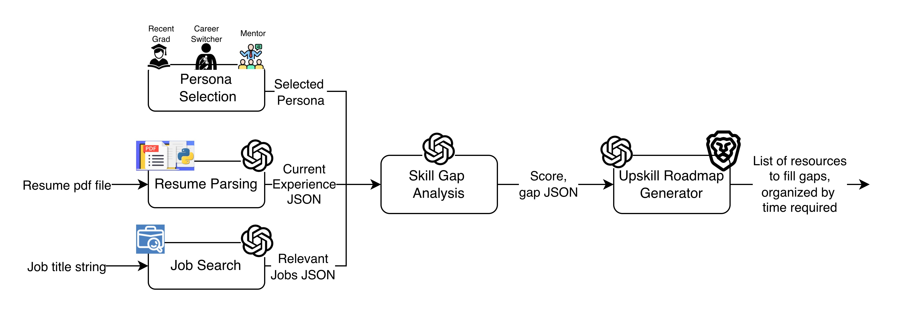

# Skill-Bridge Career Navigator

A four-step AI-powered career tool that takes a PDF resume, finds real job listings, analyses skill gaps, and generates a personalised learning roadmap with real resource URLs.

🎥 Video Presentation *(link coming soon)*

📊 [Slide Deck](https://docs.google.com/presentation/d/16oonIEplB5HSoW5fj9-vSnraVWM9CUUfhHlZ4dj3D74/edit?usp=sharing)

---

## Table of Contents

1. [Architecture Overview](#architecture-overview)
2. [How the Application Works](#how-the-application-works)
   - [Step 1 – Resume Upload & Parsing](#step-1--resume-upload--parsing)
   - [Step 2 – Job Search](#step-2--job-search)
   - [Step 3 – Gap Analysis](#step-3--gap-analysis)
   - [Step 4 – Learning Roadmap](#step-4--learning-roadmap)
3. [Persona System](#persona-system)
4. [Exact Prompts](#exact-prompts)
5. [Design Decisions & Tradeoffs](#design-decisions--tradeoffs)
6. [Getting Started on a New Machine](#getting-started-on-a-new-machine)

---

## Architecture Overview



The pipeline has three parallel inputs that converge into a two-stage AI processing chain:

**Persona Selection** — The user picks a persona (Recent Grad, Career Switcher, or Mentor) before running any analysis. The selected persona flows as a context modifier into both the Skill Gap Analysis and the Upskill Roadmap Generator, shaping how results are weighted and presented.

**Resume Parsing** — A PDF resume is fed through pdfplumber to extract raw text, which is then sent to OpenAI (gpt-4o-mini) to produce a structured **Current Experience JSON** containing skills, work experience, and projects.

**Job Search** — A job title string is used to query the JSearch API (via RapidAPI) for real, recently-posted listings. OpenAI then cleans and normalises the raw results into a structured **Relevant Jobs JSON** array.

---

The three outputs feed into the two-stage AI chain:

**Skill Gap Analysis** — OpenAI receives the Selected Persona, Current Experience JSON, and Relevant Jobs JSON simultaneously. It returns a **Score** (0–100) and a **gap JSON** listing strengths, gaps, and suggestions — all scoped to hard skills only.

**Upskill Roadmap Generator** — OpenAI uses the Score and gap JSON to generate a personalised learning plan. Brave Search then enriches each roadmap item with a real resource URL. The final output is a **list of resources to fill the identified gaps, organised by time required** (short-term, medium-term, long-term).

---

**Implementation notes**

- The frontend (Streamlit) and backend (FastAPI) communicate over HTTP. All persistent state lives in `st.session_state`; the backend is fully stateless.
- FastAPI was chosen over Flask for its native async support, required to fire all Brave Search URL lookups concurrently during roadmap generation.
- Streamlit was chosen so the entire UI could be written in Python without HTML/CSS/JS, with its session-state model mapping naturally to the wizard-style step flow.

---

## How the Application Works

### Step 1 – Resume Upload & Parsing

The user uploads a PDF resume. The frontend sends it as a multipart file to `POST /parse_resume`.

**What the backend does:**

1. Writes the PDF to a temporary file on disk.
2. Uses **pdfplumber** to extract raw text from every page.
3. Sends the extracted text to **gpt-4o-mini** with the resume-parse prompt (see [Exact Prompts](#exact-prompts)).
4. Parses the JSON from the model response using a regex fallback (`re.search(r'\{.*\}', raw, re.DOTALL)`) to tolerate any markdown fencing the model may add.
5. Returns structured JSON: `{ projects, work_experience, skills }`.

**What the frontend does:**

- Caches the result in `st.session_state["parsed_resume"]` keyed by filename so re-uploading the same file is a no-op.
- Renders editable form fields for every section (skills text area, per-entry expanders for work experience and projects) so the user can correct any parsing errors before proceeding.
- A **Save Edits** button writes the corrected data back to session state.

---

### Step 2 – Job Search

The user enters a target job title and selects how many listings to fetch (1–10). The frontend calls `POST /fetch_jobs?job_title=...&n=...`.

**What the backend does:**

1. Calls the **JSearch API** (via RapidAPI) with `date_posted: "week"` so only recent listings appear.
2. For each raw job, `_build_job_text()` assembles a text block containing title, company, description (capped at 3,000 chars), and qualifications pulled from three JSearch fields: `job_highlights.Qualifications`, `job_required_skills`, and `job_required_experience`.
3. All N job texts are sent to gpt-4o-mini in **a single batch call** (the job-extraction prompt), which returns a JSON array of cleaned job objects.
4. After the OpenAI call, `company` and `apply_link` are **overwritten from raw JSearch data** rather than taken from the model output. JSearch is the authoritative source for these values; asking the model to copy them introduces unnecessary transcription errors.
5. If OpenAI extraction fails or returns fewer items than expected, `_fallback_job()` fills the gaps directly from the raw JSearch response.

**What the frontend does:**

- Displays each job in a collapsible expander showing company, description, qualifications list, an **Apply Now** link button, and a **🗑️ Remove** button that calls `st.session_state["jobs"].pop(i)` and reruns the page.
- Always shows an **Add a job manually** form (inside an expander) so users can paste in a job ad from any source not covered by JSearch.
- A **View raw jobs JSON** expander lets technical users inspect the full payload.

---

### Step 3 – Gap Analysis

Once a resume and at least one job are present, the **Analyse My Profile** button becomes active. The frontend calls `POST /gap_analysis` with the full resume JSON, all job objects, the target job title, and the selected persona.

**What the backend does:**

1. Looks up the persona-specific context string from `PERSONA_GAP_CONTEXTS` (empty string for `"general"`).
2. For the `"switcher"` persona, injects an extra JSON field instruction (`"transferable_skills"`) into the prompt so the model returns that section.
3. Sends the assembled prompt to gpt-4o-mini at `temperature=0` for deterministic results.
4. Returns: `{ score, summary, strengths, gaps, suggestions }` plus optionally `transferable_skills`.

**What the frontend does:**

- Renders the score as a large colour-coded number (green ≥ 70, orange ≥ 40, red < 40) with a progress bar.
- Displays summary text, then strengths and gaps in two side-by-side columns.
- Shows the **🔄 Transferable Skills** section only when the `"switcher"` persona is active and the model returned that field.
- Suggestions appear below as a bulleted action list.

---

### Step 4 – Learning Roadmap

Available only after gap analysis has run and found at least one gap. The **Generate Learning Roadmap** button calls `POST /learning_roadmap` with the list of gaps, the job title, and the persona.

**What the backend does:**

1. Looks up the persona-specific context string from `PERSONA_ROADMAP_CONTEXTS`.
2. Sends the roadmap prompt to gpt-4o-mini at `temperature=0.2` (slight creativity allowed for resource suggestions).
3. For each roadmap item, fires a **Brave Search** query (`"{resource name} {provider}"`) to fetch a real URL. All queries run concurrently via `asyncio.gather` with a `Semaphore(5)` to stay within Brave's rate limits.
4. Returns the enriched array: `[ { skill, resource, provider, type, cost, time_estimate, timeframe, url } ]`.

**What the frontend does:**

- Groups items into three timeframe buckets: ⚡ Short-term (≤ 1 week), 📅 Medium-term (1–4 weeks), 🏗️ Long-term (1+ month).
- Each card shows a type icon (📚 course, 🔨 project, 🏅 certification), provider, time estimate, and cost badge.
- A **🔗 Open Resource** link points to the real URL retrieved by Brave Search.
- When the `"graduate"` persona is active, certification items get a **🎓 Cert Pick** badge to highlight their particular value for candidates with limited work history.

---

## Persona System

The persona is selected in the sidebar and is passed to both `/gap_analysis` and `/learning_roadmap` as a string parameter. There are three values:

### `general` (default)

No persona context is injected. The model applies standard gap analysis and roadmap generation without any special weighting or extra fields.

### `graduate` — Recent Graduate

**Gap analysis context injected:**
> "Persona note: This candidate is a recent graduate. Treat academic projects, coursework, and internships as equivalent to professional work experience. Weight the presence of relevant certifications highly in scoring."

**Roadmap context injected:**
> "Persona note: This candidate is a recent graduate. Prioritise certifications in the roadmap — they provide immediate, verifiable credibility for candidates with limited professional experience."

**UI effects:** Certification roadmap items display a **🎓 Cert Pick** badge.

### `switcher` — Career Switcher

**Gap analysis context injected:**
> "Persona note: This candidate is switching careers from a different industry. Add a 'transferable_skills' array to the JSON output listing hard skills from their background that directly apply to this role. Recognise cross-industry technical skills (e.g. data analysis, scripting, cloud tools) as partial matches."

**Roadmap context injected:**
> "Persona note: This candidate is switching careers. Where possible, suggest resources that explicitly bridge their prior domain to the target role and build on their existing background."

**UI effects:** The gap analysis results include a **🔄 Transferable Skills** section that would otherwise be hidden.

## Exact Prompts

### Resume Parse Prompt (`RESUME_PARSE_PROMPT`)

Sent to gpt-4o-mini at `temperature=0`.

```
You are a resume parser. Extract the following structured information from the resume text below and return ONLY valid JSON with no markdown or extra text.

Return this exact structure:
{
  "projects": [
    {"title": "...", "description": "..."}
  ],
  "work_experience": [
    {"title": "...", "description": "..."}
  ],
  "skills": ["skill1", "skill2", "..."]
}

Rules:
- "title" for work_experience should be the job title and company (e.g. "Software Engineer at Acme Corp")
- "description" should be a concise summary of responsibilities/achievements
- "skills" should be a flat list of individual skills (technologies, languages, tools, soft skills)
- If a section is missing from the resume, return an empty list for it

Resume text:
{resume_text}
```

---

### Job Extraction Prompt (`JOB_EXTRACT_PROMPT`)

Sent to gpt-4o-mini at `temperature=0`. `{n}` is the number of jobs requested; `{jobs_text}` is all N raw job blocks concatenated.

```
You are a job description parser. Given the list of raw job postings below, extract structured data for ALL of them and return ONLY a valid JSON array with no markdown or extra text.

Return this exact structure (an array, one object per job):
[
  {
    "title": "...",
    "description": "...",
    "qualifications": ["...", "..."]
  },
  ...
]

Rules:
- "title" is the job title
- "description" is a 2-3 sentence summary of the role
- "qualifications" is a combined list of all required and preferred skills and experience
- Return exactly {n} objects in the array, one per job posting below

Job postings:
{jobs_text}
```

---

### Gap Analysis Prompt (`GAP_ANALYSIS_PROMPT`)

Sent to gpt-4o-mini at `temperature=0`. `{persona_context}` is the persona string or empty. `{transferable_skills_field}` is either a JSON field snippet (switcher) or empty.

```
You are a career coach AI. Compare the candidate's resume profile against a set of job descriptions for the role of "{job_title}" and return ONLY valid JSON with no markdown or extra text.

{persona_context}

Return this exact structure:
{
  "score": <integer 0-100>,
  "summary": "<2-3 sentence overall assessment>",
  "strengths": ["<bullet 1>", "<bullet 2>", ...],
  "gaps": ["<bullet 1>", "<bullet 2>", ...],
  "suggestions": ["<bullet 1>", "<bullet 2>", ...]{transferable_skills_field}
}

Hard skills only:
- Focus EXCLUSIVELY on technical and hard skills: programming languages, frameworks, tools, platforms, methodologies, domain knowledge, and certifications.
- IGNORE all soft skills (e.g. communication, collaboration, teamwork, leadership, problem-solving, time management). Do not include them in strengths, gaps, or suggestions.

Scoring rules:
- Base the score ENTIRELY on hard skills and hands-on technical experience. Ignore education level and degree requirements.
- Extract implicit hard skills from the candidate's project descriptions and work experience descriptions, not just the explicit skills list.
- Compare those skills against the minimum and preferred qualifications AND the job descriptions.
- Weight minimum qualifications more heavily than preferred qualifications.
- 80-100: Candidate demonstrates most or all required hard skills either explicitly or through project/work experience
- 60-79: Candidate has the core hard skills but is missing some meaningful technical qualifications
- 40-59: Candidate has transferable technical skills but notable hard skill gaps exist
- 0-39: Candidate lacks most of the required hard skills for this role

For strengths: cite specific hard skills, tools, or technical experiences from the candidate's profile that match job requirements.
For gaps: cite specific hard skills, technologies, or tools mentioned in the job listings that are absent from the candidate's profile.
For suggestions: give concrete, actionable steps to close the technical gaps (e.g. "Build a project using X", "Get certified in Y", "Learn Z through a hands-on course").

Candidate profile:
{resume_json}

Job listings:
{jobs_json}
```

---

### Learning Roadmap Prompt (`ROADMAP_PROMPT`)

Sent to gpt-4o-mini at `temperature=0.2`. `{persona_context}` is the persona string or empty. `{gaps}` is the gap list as a bulleted string.

```
You are a career coach AI. Based on the skill gaps below for the role of "{job_title}", generate a personalized learning roadmap and return ONLY a valid JSON array with no markdown or extra text.

Return this exact structure:
[
  {
    "skill": "<skill this resource addresses>",
    "resource": "<specific course, project, or certification name>",
    "provider": "<e.g. Coursera, YouTube, freeCodeCamp, LeetCode, official docs>",
    "type": "<course | project | certification>",
    "cost": "<free | paid>",
    "time_estimate": "<e.g. 2 hours, 1 week, 3 months>",
    "timeframe": "<short-term | medium-term | long-term>"
  },
  ...
]

Timeframe definitions:
- short-term: can be completed in 1 week or less
- medium-term: 1 week to 1 month
- long-term: more than 1 month

Rules:
- Suggest 1-2 resources per gap, prioritising free resources where possible
- Be specific: use real course/resource names (e.g. "CS50's Introduction to AI with Python" not just "an AI course")
- Include at least one hands-on project suggestion per major gap
- Order items by timeframe (short-term first)

{persona_context}

Skill gaps to address:
{gaps}
```

---

## Design Decisions & Tradeoffs

### Single batch call for job extraction

Rather than calling OpenAI once per job, all N raw job descriptions are sent in a single prompt. This reduces latency (one round-trip vs. N) and cost. The tradeoff is that a single model failure aborts all extractions at once — mitigated by the `_fallback_job()` function, which reconstructs each job directly from the raw JSearch response if the batch call fails or returns fewer items than expected.

### Company and apply link come from JSearch, not OpenAI

After the batch extraction, `company` and `apply_link` are overwritten with values from the original JSearch data. The model is good at summarising descriptions and consolidating qualifications but is unnecessary for copying a company name or URL verbatim — and introduces transcription errors when asked to do so. Keeping the model focused on what it is good at (synthesis and reformatting) and using the source API for authoritative fields is more reliable.

### Hard-skills-only gap analysis

The scoring prompt explicitly instructs the model to ignore all soft skills. In practice, language models tend to pad gap analysis with soft-skill observations ("improve communication") that are not actionable for a job seeker and dilute the signal-to-noise ratio of the output. Restricting to hard skills makes every bullet in the strengths, gaps, and suggestions sections concrete and addressable.

### Implicit skill extraction

The gap analysis prompt instructs the model to extract hard skills from project and work experience _descriptions_, not just the explicit skills list. This is important for resumes where the skills section is sparse but the project descriptions demonstrate hands-on use of relevant technologies. Without this instruction the model systematically under-scores candidates whose resume structure buries skills in narrative text.

### `temperature=0` for structured outputs, `temperature=0.2` for roadmap

Parsing, extraction, and analysis tasks require consistent JSON structure — deterministic output (`temperature=0`) minimises the chance of structural variation. The roadmap benefits from slight creativity (`temperature=0.2`) to generate varied resource suggestions rather than the same handful of popular courses for every user.

### Concurrent Brave Search with Semaphore

Roadmap generation can produce 10–20 items, each requiring a URL lookup. Running these sequentially would add 10–20 seconds of latency. Using `asyncio.gather` with a `Semaphore(5)` fires all requests concurrently while respecting Brave's per-second rate limit. A failed URL fetch is silently swallowed (the item is returned without a URL) so that a single rate-limit spike doesn't break the entire roadmap.

### Persona as a context injection, not a separate model

Rather than maintaining different prompts per persona or fine-tuning separate models, persona behaviour is implemented as a short paragraph prepended to the existing prompt. This is sufficient for the three distinct behaviours needed (standard, graduate-friendly, switcher-friendly) and requires no additional API keys or model deployments. The tradeoff is that the persona context competes for attention with the rest of the prompt — for more nuanced personas or stricter behavioural constraints, a separate system prompt or dedicated fine-tune would be the next step.

### Stateless backend

All conversational state (parsed resume, job list, analysis results, roadmap) lives in Streamlit's `st.session_state`, not in the backend. This simplifies the backend to a pure request-response API, allows the frontend to be reloaded without losing the session (state persists until the browser tab is closed), and makes the backend trivially horizontally scalable. The tradeoff is that the state is ephemeral — a browser refresh clears everything.

### JSearch `date_posted: "week"` filter

Without this filter, JSearch returns a mix of fresh and stale listings, some of which are several months old and may no longer be accepting applications. Filtering to the past week keeps the job cards relevant and the Apply Now links live.

---

## Getting Started on a New Machine

### Prerequisites

- Python 3.10+
- A terminal (macOS/Linux) or WSL (Windows)
- API keys for:
  - [OpenAI](https://platform.openai.com/) (`OPENAI_API_KEY`)
  - [RapidAPI / JSearch](https://rapidapi.com/letscrape-6bRBa3QguO5/api/jsearch) (`RAPIDAPI_KEY`)
  - [Brave Search API](https://api.search.brave.com/) (`BRAVE_API_KEY`)

### 1. Clone the repository

```bash
git clone https://github.com/nisar2/skillbridge.git
cd skillbridge
```

### 2. Create and activate a virtual environment

```bash
python3.10 -m venv venv
source venv/bin/activate      # macOS / Linux
# venv\Scripts\activate       # Windows
```

### 3. Install dependencies

```bash
pip install fastapi uvicorn[standard] streamlit openai pdfplumber httpx python-dotenv fpdf2
```

### 4. Configure environment variables

Create a `.env` file in the project root:

```bash
cat > .env << 'EOF'
OPENAI_API_KEY=sk-...
RAPIDAPI_KEY=...
BRAVE_API_KEY=...
EOF
```

Never commit `.env` to version control.

### 5. (Optional) Generate demo resume PDFs

```bash
python generate_resumes.py
```

This creates `demo/jamie_park_resume.pdf` (recent graduate) and `demo/rachel_okonkwo_resume.pdf` (career switcher).

### 6. Start the backend

In one terminal:

```bash
uvicorn backend.main:app --reload
```

The API will be available at `http://localhost:8000`. The `--reload` flag restarts the server on file changes.

### 7. Start the frontend

In a second terminal (with the virtualenv active):

```bash
streamlit run frontend/streamlit_app.py
```

Streamlit will open `http://localhost:8501` in your browser automatically.

### 8. Demo walkthrough

| Step | Action | Recommended file / setting |
|------|--------|---------------------------|
| 1 | Upload resume PDF | `demo/jamie_park_resume.pdf` with **🎓 Recent Graduate** persona, or `demo/rachel_okonkwo_resume.pdf` with **🔄 Career Switcher** persona |
| 2 | Search for jobs | "Data Scientist" or "Machine Learning Engineer", 3–5 listings |
| 3 | Run gap analysis | Click **Analyse My Profile** |
| 4 | Generate roadmap | Click **Generate Learning Roadmap** |

### Project structure

```
skillbridge/
├── backend/
│   └── main.py              # FastAPI app — all AI and external API logic
├── frontend/
│   └── streamlit_app.py     # Streamlit UI — 4-step wizard
├── demo/
│   ├── jamie_park_resume.pdf
│   └── rachel_okonkwo_resume.pdf
├── generate_resumes.py      # Script to regenerate demo PDFs
├── logo.png                 # App logo (displayed in sidebar)
├── .env                     # API keys (not committed)
└── README.md
```
